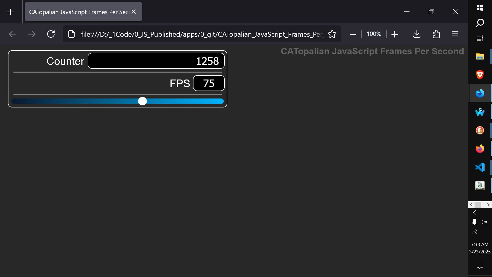

# CATopalian JavaScript Frames Per Second
A JavaScript application that changes the FPS in real time using a slider and input to set the value.  

USE APP: https://christopherandrewtopalian.github.io/CATopalian_JavaScript_Frames_Per_Second/CATopalian_JavaScript_Frames_Per_Second.html  

  

---

### How to Download this App
1. Click the green Code Button on this github page
2. Choose Download ZIP
3. Save the Zip File
4. Extract All
5. Double click the HTML file to start the App

---

Happy Scripting :-)

